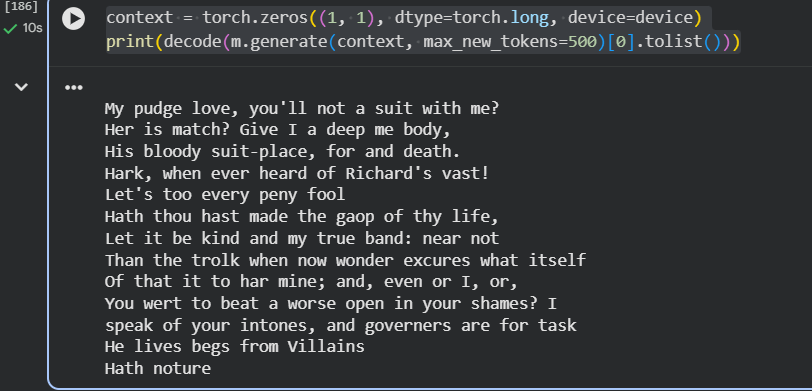

# Mini GPT From Scratch

<h1 align="center"> Mini GPT From Scratch</h1>

Built and trained a GPT-style Transformer from scratch using PyTorch.

## Demo

The model generates Shakespeare-style text after training.

## Features

- Character-level tokenizer
- Multi-Head Self Attention
- Feed Forward Network
- Layer Normalization
- Residual Connections
- Autoregressive text generation

## Dataset

Tiny Shakespeare

## Framework

PyTorch

## Results

- ~10.8M parameters
- Trained on Tiny Shakespeare
- Generates Shakespeare-style text

## Inspired By

Andrej Karpathy's "Let's Build GPT from Scratch"